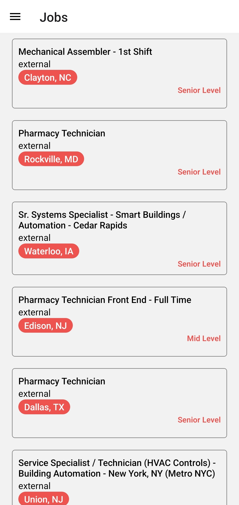
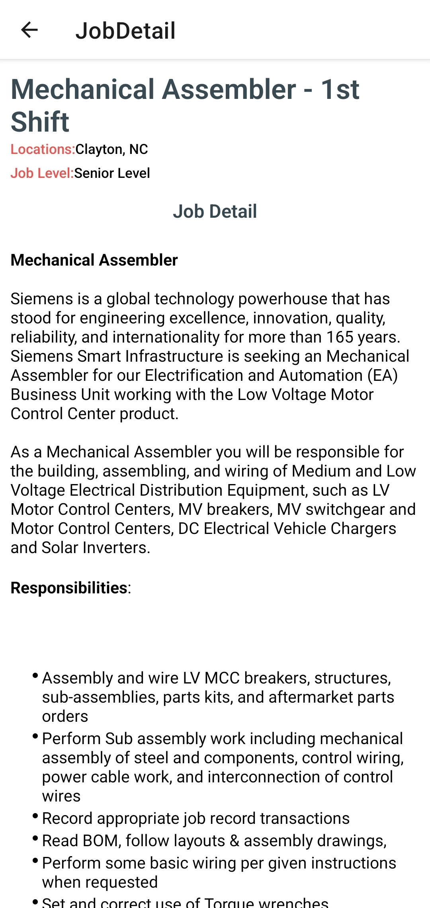
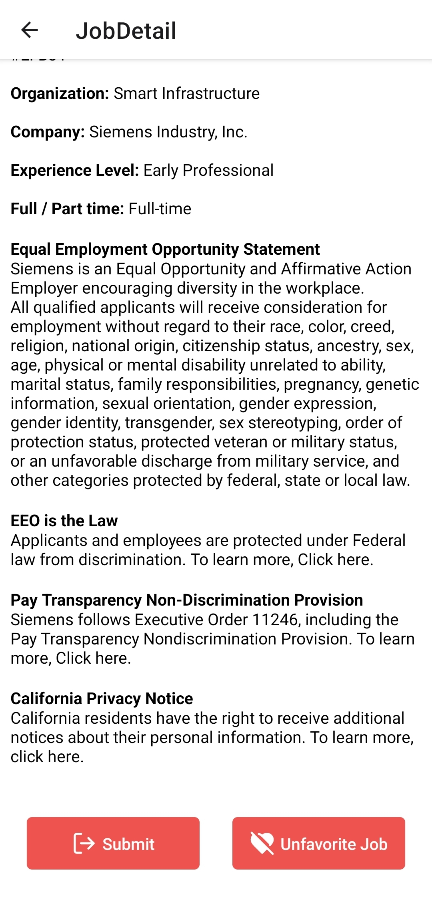
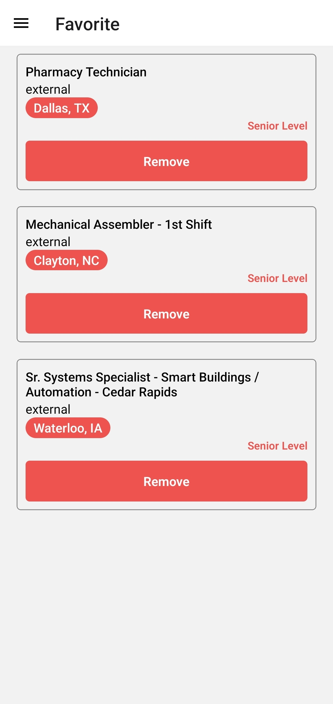

# Job Finder App

This project is part of the "Kodluyoruz React Native Mobile App" path. It is a job listing mobile application that fetches data from the Muse API and allows users to browse and interact with job listings.

## Features

- **Job Listing**: Displays job listings fetched from the Muse API.
- **Pagination**: Allows users to navigate through different pages of job listings.
- **Favorite Jobs**: Users can mark jobs as favorites, and the app tracks their favorite jobs.
- **Job Details**: Clicking on a job leads to a detailed view of the selected job.
- **Responsive UI**: The app is built with responsive layouts that work on various mobile screen sizes.

## Technologies

- **React Native**: Used for building the mobile UI.
- **Redux**: For global state management (page tracking, favorite jobs).
- **React Navigation**: For navigating between different screens in the app.
- **Muse API**: The data source for job listings.
- **RenderHTML**: Used to display job details that come in HTML format.

## Installation

1. Clone the repository:

   ```bash
   git clone https://github.com/bilalseen/codeWork.git
   cd job-finder-app

   ```

2. Install dependencies::

   ```bash
   npm install

   ```

3. Start the app:
   ```bash
   npm start
   ```

### Screenshots

### Screenshots

<div style="text-align: center;">
  <table style="margin: 0 auto;">
    <tr>
      <th style="text-align: center;">Home</th>
      <th style="text-align: center;">Detail Page</th>
      <th style="text-align: center;">Detail Page<br>(Unliked)</th>
      <th style="text-align: center;">Detail Page<br>(Liked)</th>
      <th style="text-align: center;">Favorite Page</th>
    </tr>
    <tr>
      <td style="text-align: center;">
        
      </td>
      <td style="text-align: center;">
        
      </td>
      <td style="text-align: center;">
        
      </td>
      <td style="text-align: center;">
        
      </td>
      <td style="text-align: center;">
        
      </td>
    </tr>
  </table>
</div>

## API Information

The app uses the Muse API to fetch job listings. The API provides comprehensive job data, including name, type, location, and level.

## State Management

The application uses Redux for state management, particularly for tracking:

- **Current Page:** Managed with **pageSlice**, which updates the current page based on user interaction with pagination.
- **Favorite Jobs:** Managed with **favoriteJobSlice**, which stores the list of favorited jobs.

## Folder Structure

```bash
├── components
│   ├── JobCard.js           # Job card component for displaying job info
│   ├── Pagination.js        # Pagination component for page navigation
├── hooks
│   └── useFetch.js          # Custom hook for fetching job data from the API
├── redux
│   ├── jobSlice.js          # Redux slice for managing job data
│   ├── pageSlice.js         # Redux slice for managing pagination state
│   ├── store.js             # Redux store setup
├── route
│   ├── Drawer.js            # Drawer navigation setup
│   └── Router.js            # Main app routing and navigation setup
└── screens
    ├── Favorite.js          # Screen for displaying favorite jobs
    ├── JobDetail.js         # Screen for displaying job details
    └── Jobs.js              # Main job listing screen

```

## How it works

- **Job Listings:** Jobs are fetched from the Muse API and displayed in a list using the **FlatList** component.
- **Pagination:** The app supports pagination, where users can navigate between pages of job listings.
- **Favorites:** Users can add or remove jobs from their favorites list, which is managed using Redux.

## License

This project is licensed under the MIT License - see the LICENSE file for details.
